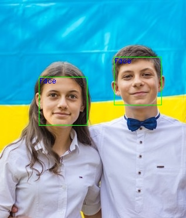

# opencv-detect-faces
Use of OpenCV's (reference [1]) implementation of Haar feature-based cascade classifier, to detect human faces in images. OpenCV provides many pre-trained face detectors, stored as XML files on [github](https://github.com/opencv/opencv/tree/master/data/haarcascades). In my implementation I used the haarcascade_frontalface_alt.xml.
The demonstration code was executed in unprocessed input images in order to highlight the pros and cons of the tested classifier.
The source of the test images can be found in reference [2].

## Components
The implementation of the project is in python and it is included in the below file:
```
detectFaces.py : The script includes:
    - FacesDetectorCV class: Face detector class based on openCV cascade classifier.
    - Demonstration code.
```

## Executing the demonstration code (Usage)
The project can be executed as explained below:
```
$python detectFaces.py
``` 
The script loads all the ```*.jpg``` test images located in the ```test_images``` folder. Then it executes the detect faces flow on these images and places the results in the ```test_result_images``` folder.


## Test Results
The performance of the cascade classifier was evaluated in the below test images. As it can be seen in the below show cases, the cascade classifier used performs very well for clear faces with almost perfect orientation towards the camera. Otherwise, it may fail to detect the faces in a given image. 

#### Test Image 0: Clear faces with perfect orientation towards the camera


#### Test Image 1: Clear faces without perfect orientation towards the camera, for some faces


#### Test Image 2: Unclear faces (use of sunglasses) with perfect orientation towards the camera


#### Test Image 3: Clear faces without perfect orientation towards the camera, for all faces


#### Test Image 4: Unclear faces (use of glasses) without perfect orientation towards the camera


## System Requirements (Dependencies)
The script has been developed and verified in a **Python 3.7** environment. Installation details of python, can be found in the following link: [Python Installation](https://www.python.org/downloads/)

The script imports the below packages:

```
openCV, version 4.1.2
```

* Install openCV in anaconda using: ```pip install opencv-python```


## References
1. *https://docs.opencv.org/4.1.2/db/d28/tutorial_cascade_classifier.html*
2. *https://www.pexels.com/search/group%20of%20people/*

